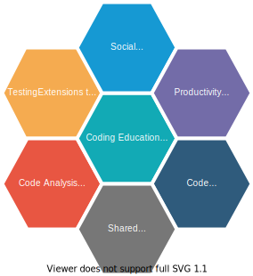

# About
This project aims to use extensions to keep people connected and engaged in a remote learning environment.
This file is meant to be a place to document extensions for consideration.
The `.vscode/` is used primarily to recommend the approved extensions for local development, the `.gitpod.yml` is used to configure the remote environment as a whole (which can include the codium versions of these extensions).

# Extension Goals & Areas 
There are 7 areas of where an extension should aid users.

## Social Extensions
**Pair Programming & Code Reviews**
- https://marketplace.visualstudio.com/items?itemName=CodeStream.codestream
  

**Chat**
- https://marketplace.visualstudio.com/items?itemName=sozercan.slack
- https://marketplace.visualstudio.com/items?itemName=alperg.slack-vscode