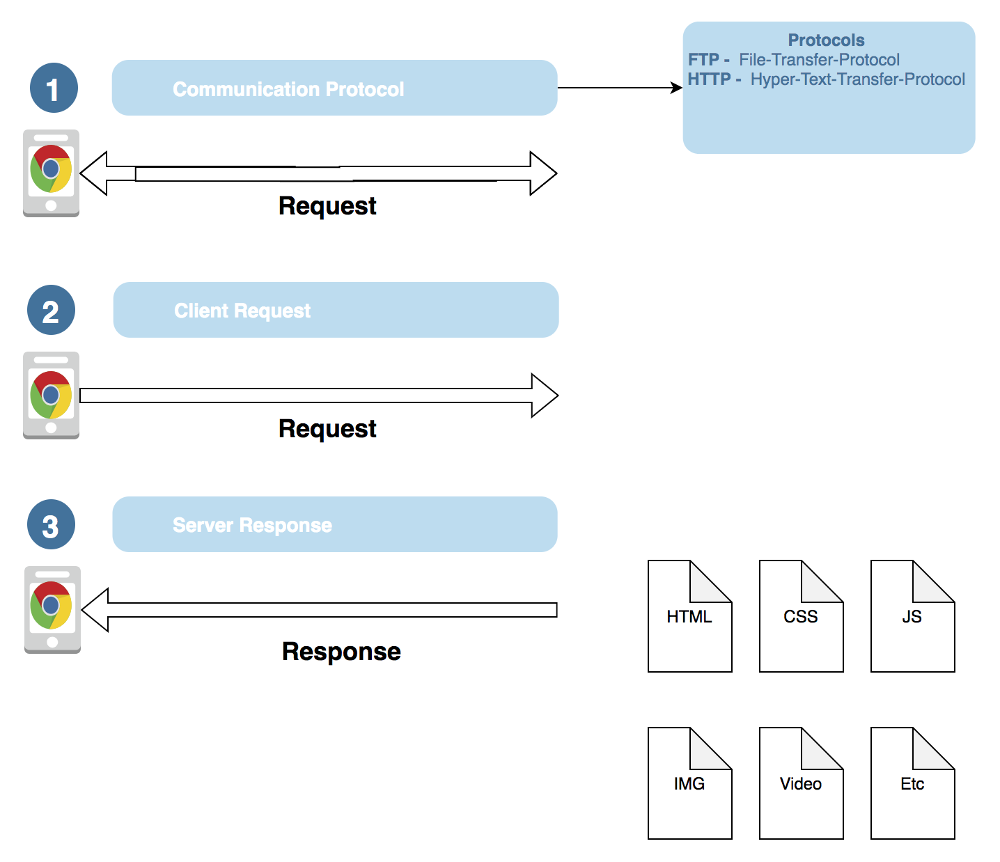

<style>
#logo { 
  position: initial !important;
  left: 0!important; 
  top: 0%!important; 
  text-align: center;
  padding-top:1em;

}
#logo > img {height: 10em; max-height: none;}

.slides{
}

.slides > section.present{
top: -20%!important;

}

/* #logo {
    position: inherit!important;
    top: 0!important;
    left: 0!important;
    text-align: center;
}

body > div.reveal.slide.center.has-horizontal-slides.ready > div.slides > section.present{
  top:0!important;
} */
.p1{padding:1em; border:none}
</style>


### When does node become a server?

Simplest explaination is when it is installed on a server. Another way to look at it is whenever we use a protocol like HTTP to between a client and a server.

---

### What is HTTP?

HyperText Transfer Protocol
* Used to send text-based files such as HTML, CSS, etc.
* Read about it on [wiki](https://en.wikipedia.org/wiki/Hypertext_Transfer_Protocol).

---

### How HTTP Protocol works


[]()

<!-- []() -->

---

### Sending HTML with HTTP

```javascript
const http = require('http')
const fs = require('fs');
const PORT = 7000;
http.createServer(function (request, response) {
  if (request.url == '/') {
    fs.readFile('index.html', function(err, data) {
      response.writeHead(200, {'Content-Type': 'text/html'});
      response.write(data);
      return response.end();
    });
  }
  else{
    return response.end('Invalid request');
  }
}).listen(PORT);
```

Import / require node.js [API Modules](https://nodejs.org/docs/latest/api/). { .fragment .current-only data-code-focus=1-2}

This module creates the connection to our server and uses the http protocol. {.fragment .current-only data-code-focus=1-1}

This module is used to read files. {.fragment .current-only data-code-focus=2-2}

Creates a server and consumes port 7000. {.fragment .current-only data-code-focus=3-15}

If the **request** is localhost:7000/, then return a response with index.html {.fragment .current-only data-code-focus=5-11}

ELSE KILL the server, then return invalid response {.fragment .current-only data-code-focus=12-14}

Uses FS to read the the html file. {.fragment .current-only data-code-focus=6-6}

Inside the **callback**, define the correct **HTTP header** with the correct **content type**. {.fragment .current-only data-code-focus=7-7}

---

### Create a function that returns HTML

```javascript
const HTML = (header,body,footer) => {
  return `
  <!DOCTYPE html>
  <html lang="en">
  <head>
    <meta charset="UTF-8">
    <meta name="viewport" content="width=device-width, initial-scale=1.0">
    ${header}
  </head>
  <body>
  <h1>${body}</h1>
  ${footer}
  </body>
  </html>`;
}
```

This function has 3 parameters, a header, a body and footer. {.fragment .current-only data-code-focus=1-1}

---

### HTTP With JavaScript ES6

```javascript
const http = require('http')
const fs = require('fs');
const PORT = 7000;
const HTML = (header,body,footer) => {/* code from above */}

http.createServer(
  (request,response)=>{
    if (request.url == '/') {
      fs.readFile('index.html', (err, data) => {
        response.writeHead(200, {
          'Content-Type': 'text/html',
          'Content-Length': HTML.length,
          'Expires': new Date().toUTCString()
        })
        response.end(
          HTML(
          `<link rel="stylesheet" href="/public/style.css">`,
          `<h1>HELLO</H1>`,
          `<script src="/public/alert.js"></script>`) 
        );
      })
    }
  }
).listen(PORT);

http.createServer(function (request, response) {
  if (request.url == '/') {
    fs.readFile('index.html', function(err, data) {
    res.writeHead(200, {
      'Content-Type': 'text/html',
      'Content-Length': HTML.length,
      'Expires': new Date().toUTCString()
    })
    res.end(
      HTML(
      `<link rel="stylesheet" href="/public/style.css">`,
      `<h1>HELLO</H1>`,
      `<script src="/public/alert.js"></script>`) 
    );
    });
  }
  else{
    return response.end('Invalid request');
  }
}).listen(PORT);
```

Get the length of the html string and set the content-length **HTTP Header**. {.fragment .current-only data-code-focus=10-10}

Call the HTTP function and pass the information you need. {.fragment .current-only data-code-focus=14-17}

This is a String. {.fragment .current-only data-code-focus=3-3}

This is a Number. {.fragment .current-only data-code-focus=4-4}

This is a Boolean. {.fragment .current-only data-code-focus=5-5}

This is a Symbol. {.fragment .current-only data-code-focus=6-6}

This is a BitInt. {.fragment .current-only data-code-focus=7-7}


---

### Check it the full book

By Hans McMurdy

