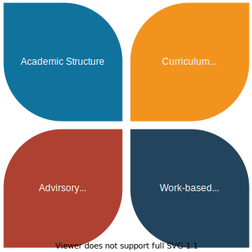
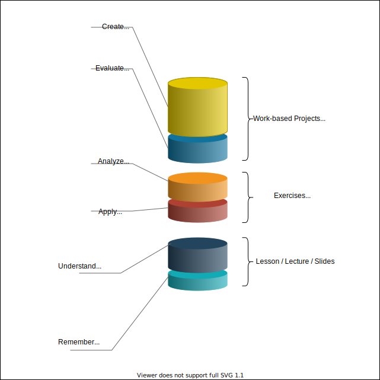

---
# This file is best viewed in vscode using vscode-reveal
# https://marketplace.visualstudio.com/items?itemName=evilz.vscode-reveal
title: "Welcome to the Twitch Class"
logoImg: "logo.svg"
theme : "night"
transition: "slide"
highlightTheme: "monokai"
# slideNumber: true
# loop: true
autoSlide: 200000 
# # openButton: false
# enableMenu: false
# # controlsLayout: 'edges'
# # controls: true
# enableChalkboard: false
# # enableTitleFooter: false
# autoSlideStoppable: true
---

<!-- Global site tag (gtag.js) - Google Analytics -->
<script async src="https://www.googletagmanager.com/gtag/js?id=UA-176679651-1"></script>
<script>
  window.dataLayer = window.dataLayer || [];
  function gtag(){dataLayer.push(arguments);}
  gtag('js', new Date());

  gtag('config', 'UA-176679651-1');
</script>
<!-- <link rel="stylesheet" href="https://stackpath.bootstrapcdn.com/bootstrap/5.0.0-alpha1/css/bootstrap.min.css" integrity="sha384-r4NyP46KrjDleawBgD5tp8Y7UzmLA05oM1iAEQ17CSuDqnUK2+k9luXQOfXJCJ4I" crossorigin="anonymous"> -->
<link rel="stylesheet" href="./theme.css">


### About the Streamer 

<div class="flex-slide">

:::block
<p align="center">
   <a href="https://github.com/users/HansUXdev/sponsorship">
      
   </a>
</p>

```javascript
const fullname = {first:"Brett", middle:"Hans", last:"McMurdy"}
let {middle} = fullname;
let name = middle;
console.log(name);
```
{.column}
:::

:::block
   My name is "Hans" . {.fragment .current-only .xxlg data-code-focus=4-5 }

   I've be coding for 5+ years and my last full time job was teaching #JavaScript in public high school as a certified Career and Technical Education (CTE) teacher. {.fragment .current-only .lg}
   
{.double-column}
:::

</div>

--

<!-- ### Today's Class.. -->
<!-- Today is a free day for me to live code whatever I want. {.fragment .current-only  } -->

#### Today's Lesson: How to rapidly design and prototype a website with @drawio @FoundationCSS @GitPod.


 {.fragment}

<div class="flex-slide">

:::block
What you need to do in order to follow along ! {.fragment .xlg}

1. Join me in Twitch chat !
2. Use these slides: hansmcmurdy.com/JavaScript-First/Twitch.html {.fragment}
3. These will be updated before and after the live stream {.fragment}
4. Open up Chrome and install the  extension from [gitpod](https://chrome.google.com/webstore/detail/gitpod-dev-environments-i/dodmmooeoklaejobgleioelladacbeki). {.fragment}
5. Signup for [Github](https://github.com/) and sign into the account {.fragment}
6. Find the foundation template: https://github.com/foundation/foundation-zurb-template {.fragment}
7. Click the **fork button** to make your own copy.{.fragment}
8. Click the **GitPod button** that appears with the chrome extension above. {.fragment}
9. Open it on GitPod {.fragment}
10. Follow along as best as you can and shout out to me in chat if I'm going to fast. {.fragment}
11. Video to pre {.fragment}
<!-- 8. Fork it  {.fragment} -->
<!-- - [ ]  -->
{.column }
:::

:::block
Things I'll talk about: {.fragment}

1. What is @gitHub VS @GitPod {.fragment}
2. What is @drawio {.fragment}
3. What is @FoundationCSS, web & email {.fragment}
4. How to use the Foundation CLI {.fragment}
5. How to use GitPod & Configure it for the above {.fragment}
   
{.double-column .fragment}
:::


</div>

---

#JavaScriptFirst

Most of my content is for an **Open Source Book** based off **state standards**, geared toward students and able to be **run on low end hardware** such as a table, old PC or even a raspbery pi (with GitPod). {.fragment}

There will eventually be a **teacher-version** that could be adopted in other schools, bootcamps, universities who become contributors (financially or code / content contributors). {.fragment}

<p align="center">
   <a href="https://github.com/users/HansUXdev/sponsorship">
      
   </a>
</p>

Learn more about the content by scrolling down

--

### What this book covers:
This content is still in **early access** and **open source**.
The content is made to be **open source curriculum**. {.fragment}

You will learn how to code with JavaScript using the node.js runtime environment rather than a browser and by the end, you will build a server and a website using JavaScript. {.fragment}


Content will ALWAYS be free for STUDENTS. {.fragment}

A live version of the first two chapters is available on  [twitch.tv/hansoncoding](https://www.twitch.tv/hansoncoding/about). {.fragment}

It takes a **blended learning approach** . {.fragment}

[](https://www.twitch.tv/hansoncoding) {.fragment}

If the button ^ is live, click it and join free classes online, otherwise follow. {.fragment}

--


### My Approach
I to apply the CTE model toward teaching as well as to the way I develop my content.



---

### Blooms
This is a visual illustration of how I approach learning objectives using bloom's taxonomy.



--

## Objectives of the course
Teach anyone 16+ how to code a website, server and mobile app using **JavaScript**.

--

### About GitPod
[GitPod](http://gitpod.io/) is used to provide readers and students with a **zero-config developer environment** where they can follow along even on a chromebook or tablet.

This is helps provide an **interactive experiance** through  [codetogether](https://www.codetogether.com/), [gitduck](https://gitduck.com/) and other means of activities that facilitate remote learning. 

<p align="center">  
   <a href="https://gitpod.io/#https://github.com/HansUXdev/JavaScript-First"></a>  
</p>

---

### #JavaScriptFirst Content

Read more about the current [Version 0.1](https://hansmcmurdy.com/JavaScript-First/#/2) or scroll down for more info.

--

#### Chapter 1: Reteaching JavaScript & Web Development

> **Objective:** Students should know the syntax of JavaScript and how to use variables, hoisting, objects, functions, etc {.fragment .current-only  }

| Lessons        | Type |
|-------------|:-----------:|
| [History of JavaScript](https://medium.com/javascript-in-plain-english/a-brief-history-of-javascript-9289a4d344d2)   | Article  |
| [Learning Terminal, NVM, Git & Node.js](https://medium.com/swlh/terminal-basics-and-installing-nvm-node-js-631cf9476ac4)   | Activity  |
| [JavaScript Datatypes](https://medium.com/javascript-in-plain-english/what-do-you-really-know-about-variables-data-types-and-immutability-in-javascript-1730835a9e87?source=friends_link&sk=f71e5c38da34456f55ed813b23d4ed78)   | Code Along  |
| [Types of Functions](01-Reteaching-JavaScript/04-TypesOfFunctions/FunctionTypes/index.html)   | Code Along  |
| Logging Datatypes    | Exercise  |
| War Game?    | Exercise  |

[View the whole chapter](/01-Reteaching-JavaScript/Overview.html) {.fragment .current-only  }

--

####  Chapter 2: Introduction to Web Development with HTTP
> **Objective:** Students will build their first website and deploy it by the end of the chapter. {.fragment .current-only  }

| Lessons     | Type |
|-------------|:-----------:|
| Learn HTML by building an HTTP Server with Node.js    | Exercise  |
| Build a dynamic Website with Vanilla.js with Functions & Template Strings          | Exercise  |
| Deploying a Dynamic site with HTTPS & Open SSL        | Exercise  |


--

####  Chapter 3: Test Driven Development
> **Objective:** Students will learn how to write tests for code challenges and to automate front-end testing tasks. {.fragment .current-only  }

| Lessons                        | Type |
|--------------------------------|:-----------:|
| Writing Unit Tests             | Exercise  |
| Automate Responsive Testing with puppeteer   | Exercise  |
| Automate Cross-Browser with puppeteer   | Exercise  |
| Build a Twitter Bot   | Exercise  |

--


### Future Chapters
Future chapters and sub chapters in this book will be available on github in the [/00-Drafts](https://github.com/HansUXdev/JavaScript-First/tree/master/00-Drafts) directory.

Current Content may include:
1. [Learn Mongo GitPod](https://github.com/HansUXdev/LearnMongoGitPod) {.fragment}
2. War Games CLI Project  {.fragment}
3. React {.fragment}
4. Data Structures {.fragment}
5. Algorithms {.fragment}

---

### Wecome to class... 

 {.fragment}

<div class="flex-slide">

:::block

1. Open up the Content: 
   hansmcmurdy.com/JavaScript-First/ {.fragment}
2. These Slide: hansmcmurdy.com/JavaScript-First/Twitch.html {.fragment}

{.column}
:::

:::block
1. Signup for [Github](https://github.com/) {.fragment}
2. Go to the [course repository](https://github.com/HansUXdev/JavaScript-First) at github.com/HansUXdev/JavaScript-First{.fragment}
3. Fork it  {.fragment}
4. Open it on GitPod {.fragment}
5. Follow along in text (readme files or [medium](https://medium.com/@HansOnConsult)) or video ([twitch](https://www.twitch.tv/hansoncoding) / [youtube](https://www.youtube.com/channel/UCCGfELkPCJg1XHxQfFFz7pw/about)) {.fragment}
   
{.double-column}
:::


</div>

--

### Supporting the Content
If you like the any of the content, there are several ways you can show your support without paying a penny.

**Support Open Source:**

[](https://github.com/HansUXdev?tab=followers) [](https://github.com/HansUXdev/JavaScript-First/stargazers)

Tweet about it using the hashtag #JavaScriptFirst
<!-- You can also consider becoming a supporter in order to help motivate me to do a bunch more awesome stuff. -->

---


### Why should consider becoming a sponsor:

<div class="flex-slide">

:::block

1. **Raffle** every month to give back to my supporters to help it grow.
{.fragment }

2. Network with school administrators/teachers and industry professional in order to **bring tech leaders into the classroom** (zoom || in-person).  {.fragment }
   
3. Advocate the adoption of **open source certifications** in CTE schools.  {.fragment }

{.column}
:::


:::block
   
4. Help donate 4G laptops/tablets to students who are struggling during COVID.  {.fragment }
   
5. Create an affordable educational community that teaches people how to code and helps them achieve success in their careers.  {.fragment }

{.double-column}
:::

</div>


[Consider becoming a Github Sponsor](https://github.com/users/HansUXdev/sponsorship)  {.fragment }

[Consider becoming a Patreon](https://www.patreon.com/hansOnDevelopment) {.fragment }